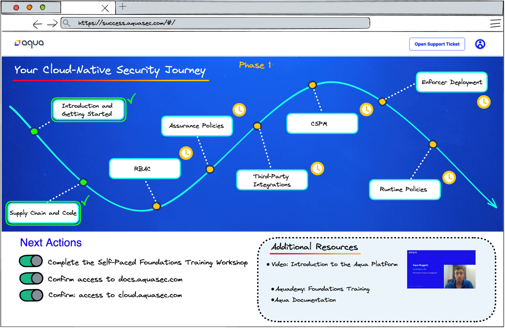

# [digitalsuccess.aquasec.com](https://digitalsuccess.aquasec.com)

This is the repository home for the self-service portal known as the Digital Success platform.  The aim of this project is to capture much of the knowledge needed to onboard a new customer and present it in a format where the customers can easily onboard themselves using a combination of articles, videos, and training modules.

We aim to provide guidance and direction to new customers and help them on their journey.  We can achieve this by leveraging existing resources (ie. documentation, training modules, reference architectures) but presenting these resources in a way that feels to the customer like a guided path or yellow-brick road.

The current form of this portal exists as a static HTML site redered by mkdocs.  This will allow us to get started with producing and publishing the necessary content.  However, the long-term goal is to build a platform that is interactive and dynamic, following each customer's specific journey based on their own set of goals and interests.


*Mock-up of a guided path interface*

> Interested in contributing?  Please make sure you review the [Contributing](#Contributing) section.

## Overview

This entire repository is built on top of the [mkdocs-material](https://squidfunk.github.io/mkdocs-material/getting-started/) platform and all documentation is produced in [Markdown](https://www.markdownguide.org/basic-syntax/).

MkDocs requires a recent version of Python and the Python package manager, `pip`, to be installed on your system.

You can check if you already have these installed from the command line:

```
$ python --version
Python 3.8.2
$ pip --version
pip 20.0.2 from /usr/local/lib/python3.8/site-packages/pip (python 3.8)
```

### Installing Material for MkDocs

```
pip install mkdocs-material
```

This will automatically install compatible versions of all dependencies: [MkDocs](https://www.mkdocs.org/), [Markdown](https://python-markdown.github.io/), [Pygments](https://pygments.org/) and [Python Markdown Extensions](https://facelessuser.github.io/pymdown-extensions/). Material for MkDocs always strives to support the latest versions, so there's no need to install those packages separately.

For more information, please visit the [Material for MkDocs documentation](https://squidfunk.github.io/mkdocs-material/getting-started/).

### Running Mkdocs with Docker

Build the Docker container
```
docker build -t aqua-ps/mkdocs-material .
```
Mount the folder where your mkdocs.yml resides as a volume into /docs:

Start development server on http://localhost:8001
```
docker run --rm -it -p 8001:8000 -v ${PWD}:/docs aqua-ps/mkdocs-material
```

Build documentation
```
docker run --rm -it -v ${PWD}:/docs aqua-ps/mkdocs-material build 
```

For detailed installation instructions, configuration options, and a demo, visit squidfunk.github.io/mkdocs-material

## Contributing

Additions, modifications, and corrections are encouraged from anyone interested in this project!  There are some basic rules to follow:

1. Please make all modifications to *your own branch* of the project.
1. Ensure that your changes render correctly by running mkdocs locally and viewing the changes in your browser *before creating a PR*.
1. If you've added new pages or sections, ensure that you've edited the `mkdocs.yml` file and added to the `nav` section so that the documents are properly indexed.
1. Only markdown (.md) and image content is permitted in this repository. Please don't push .docx or other file types.
