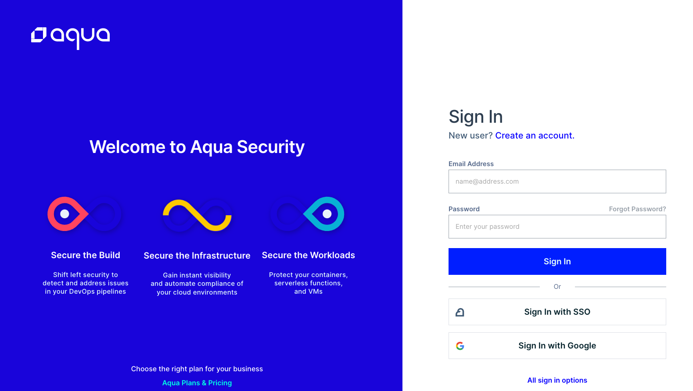
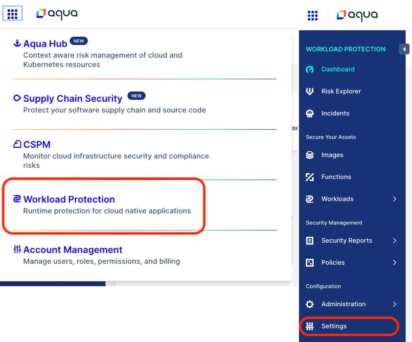
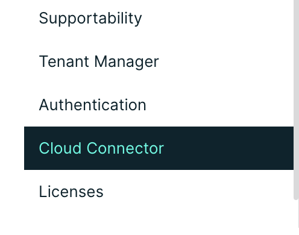
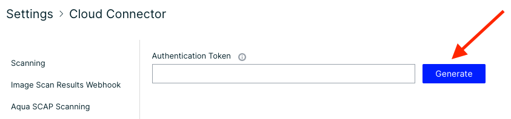
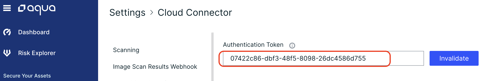

## Aqua Cloud Connector

The Aqua Cloud Connector is used in conjunction with Aqua Platform SaaS Edition (Enterprise Plan) and ESE environments.

When deployed on local clusters, i.e., clusters on which Aqua Platform is not deployed, the Aqua Cloud Connector establishes a secure connection to the Aqua Platform console, giving Aqua Platform remote access to resources on the local clusters.

The local resources supported are registries for container images and serverless functions; for simplicity, we will refer to all as images. Once you deploy the Connector on a local cluster, you are ready to go! You can create a new image registry integration and test its connectivity to ensure the deployment is successful. Once the integration is saved, the Aqua Platform console can access your registry and perform standard Aqua Enterprise operations, such as searching the registry for images and auto-pulling them. Image scanning is performed by Aqua Scanners deployed on your local clusters.

### Architectural diagram


### Cloud Connector Deployment and Configuration

The Aqua Cloud Connector is deployed as a simple Kubernetes deployment.

The first step in deploying the Cloud Connector is to generate your authentication token:

1. Log into https://cloud.aquasec.com 

2. Navigate to Workload Protection and go to Settings

3. Under Settings, navigate to Cloud Connector

4. Click "Generate" next to the Authentication Token box 

5. Copy the token and paste into a notepad


#### Deploy Cloud Connector with Helm

Aqua Helm Charts are located in our Github repository [here](https://github.com/aquasecurty/aqua-helm) or you can add the helm repository as below:
```
    helm repo add aqua-helm https://helm.aquasec.com
    helm repo update
```
If you didn't clone the helm repo from Github, you can pull the values yaml like using the following command:
```
    helm show values aqua-helm/cloud-connector > values.yaml
```
Modify the values.yaml for the cloud connector with your relevant information:

Add the image pull secret here if needed:
```
    imageCredentials:
      create: true
      name: <registry name> ## When create is false please specify
      repositoryUriPrefix: <repository URI> # for dockerhub - "docker.io"
      registry: <registry URL> #REQUIRED only if create is true, for dockerhub - "index.docker.io/v1/"
      username: ""
      password: ""
```
Specify whether or not the Service Account needs to be created:
```
    serviceaccount:
      create: false
      name: aqua-sa
```
Add your SaaS Gateway address and port 443:
```
    gateway:
      host: "<ID>-gw.cloud.aquasec.com"   # Gateway Host Address
      port: "443"               # Gateway Port
```
Ensure that auth type is set to Token:
```
    authType:
      tokenAuth: true     # Boolean Value(true/false) to enable/disable token based authentication
      userCreds: false    # Boolean Value(true/false) to enable/disable user/password authentication
```
Specify the resource limits according to your environment needs or use the defaults:
```
    resources:
      # Note: For recommendations please check the official sizing guide.
       requests:
         cpu: 500m
         memory: 0.5Gi
       limits:
         cpu: 2000m
         memory: 2Gi
```
Lastly, configure your tunnels to your local private registries:
```
    tunnels:
      # ACR - Azure Container Registry
      azure:
        registryHost: ""
        registryPort: ""
      # ECR - Amazon Elastic Container Registry
      aws:
        registryHost: ""
        registryPort: ""
        type: ""
        region: ""
      # GCR - Google Container Registry
      gcp:
        registryHost: ""
        registryPort: ""
      # JFrog Container Registry
      jfrog:
        registryHost: ""
        registryPort: ""
      # Onprem Container Registry
      onprem:
        registryHost: ""
        registryPort: ""
```
Deploy the cloud connector by running the following commands:
If you cloned the aqua-helm rpository:
    
```
    #Run commands from the root of the aqua-helm directory
    kubectl create ns aqua
    helm install --namespace aqua <releaseName> ./cloud-connector
```
If you are installing from the Helm repository:
```
    helm install --namespace aqua <releaseName> aqua-helm/cloud-connector -f <location of the values.yaml>
```
You can verify that the cloud connector is connected to the console by checking the cloud connector logs. You should see the following message when you are connected to the console:
<br>
*** "connection established with remote server" ***

