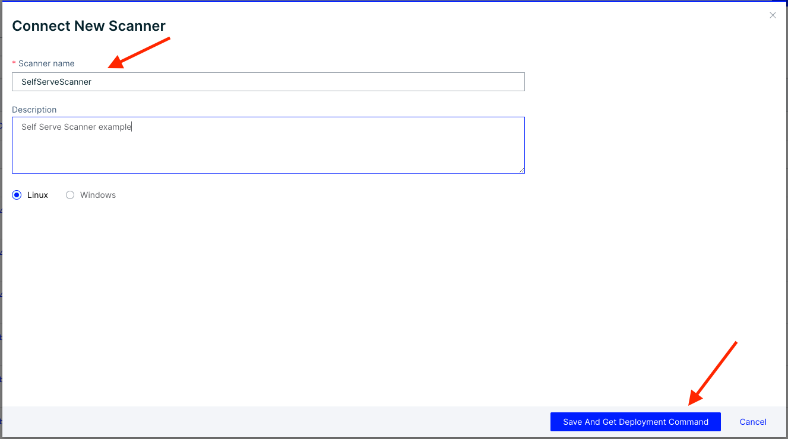

# Deploy Scanners

The primary function of the Aqua scanner (or simply "scanner") is to scan the following types of objects for security issues:

* Container images
* VMware Tanzu applications
* Functions (serverless)

Security issues are defined as vulnerabilities, sensitive data, and malware. The scanner looks for the following, depending on the scanned object type:

| **Scanned object**   | **Security Issues Scanned For**                             |
|                      |                                                             |
| **Container Images** | Vulnerabilities, sensitive data, and malware                |
| **VMWare Tanzu**     | Vulnerabilities, sensitive data, and malware                |
| **Functions**        | Vulnerabilities, sensitive data, and excessive permissions. |

Object scanning is supported by the [Aqua CyberCenter](https://docs.aquasec.com/v2022.4/platform/aqua-cybercenter/cybercenter-description/), which maintains up-to-date information on vulnerabilities and malware. Once an object is scanned, the scanner reports the results to the Aqua Server, which makes them available through the Server UI and REST APIs.

Secondary functions of the scanner include registering container images with Aqua and importing results of scans already performed.

## Deployment steps

After deploying the cloud connector you can now deploy the scanners
Be sure to review the following sizing guide recomendations for your scanner deployment:

| **Component** | **Resource** | **Sizing** |
|               |              |            |
| Aqua Scanner Legacy (ea) | CPU | 1,000 - 2,000 |
|  | Memory | 0.5 - 1.0 |
|  | Storage | At least twice the size of largest image |
| Aqua Trivy Premium | CPU | 1,500 - 4,000 |
|  | Memory | 0.5 - 3.0 |
|  | Storage | At least twice the size of largest image |

Like the Cloud Connector, the first step to deploying the Scanner is to create your Scanner and Authentication Token

1. Navigate to Workload Protection and go to Administration -> Scanners
2. Click Connect Scanner

<table><tr>
<td>  </td>
<td>  </td>
</tr></table>

3. Give your scanner a name and description then click --> Save And Get Deployment Command

4. Copy the authentication token and paste it into a clipboard for later

5. Copy the Host URL and paste it into the clipboard for later


## Deploy the Aqua Scanner with Helm

Aqua Helm Charts are located in our Github repository [here](https://github.com/aquasecurty/aqua-helm) or you can add the helm repository as below:

```
    helm repo add aqua-helm https://helm.aquasec.com
    helm repo update
```
If you didn't clone the helm repo from Github, you can pull the values yaml like using the following command:
```
    helm show values aqua-helm/scanner > values.yaml
```
Modify the values.yaml for the scanner with your relevant information:

Add the image pull secret here if needed:
```
    imageCredentials:
      create: true
      name: <registry name> ## When create is false please specify
      repositoryUriPrefix: <repository URI> # for dockerhub - "docker.io"
      registry: <registry URL> #REQUIRED only if create is true, for dockerhub - "index.docker.io/v1/"
      username: ""
      password: ""
```

Enable or disable Direct CC - This setting determines if the scanners connect directly to Cybercenter or if only the console does.  Recomended to leave as "True"

```
    directCC:
      enabled: true     # Change it to false if the scanners don't connect directly to CyberCenter but only console does
```

Specify whether or not the Service Account needs to be created:
```
    serviceaccount:
      create: false
      name: aqua-sa
```

Set your console scheme to "https", add your unigue console URL, and change the port to 443:
```
    server:
      scheme: "https" #specify the schema for the server host URL, default it is http
      serviceName: "<ID>.cloud.aquasec.com" # example
      port: 443
```
Add the token that you copied earlier here:
```
    scannerToken: ""    # token used for deploying USE scanners
```
Set any extra environement variables needed by the scanner pods here (ex. http_proxy, https_proxy, etc...):
```
    extraEnvironmentVars: {}
    #  ENV_NAME: value
```
Optional: Here you can specify the registries that these scanners will connect to:
```
    registries: []
    # registries:
    # - registry1
    # - registry2
```
Deploy the cloud connector by running the following commands:
If you cloned the aqua-helm rpository:
<br>
*** Dont forget to set your release name to begin with a numeric value to move it to the top of the list ***
```
    #Run commands from the root of the aqua-helm directory
    kubectl create ns aqua
    helm install --namespace aqua <releaseName> ./scanner
```
If you are installing from the Helm repository:
```
    helm install --namespace aqua <releaseName> aqua-helm/scanner -f <location of the values.yaml>
```
You can verify that the scanners are connected to the console by checking the UI of the console or checking the pod logs:


# [Connect the Private Registry](registrysetup.md) 