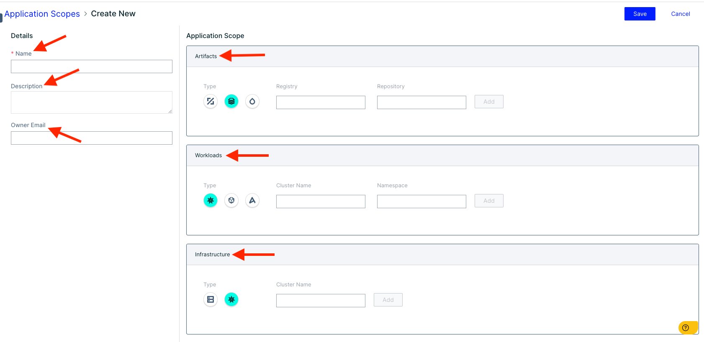
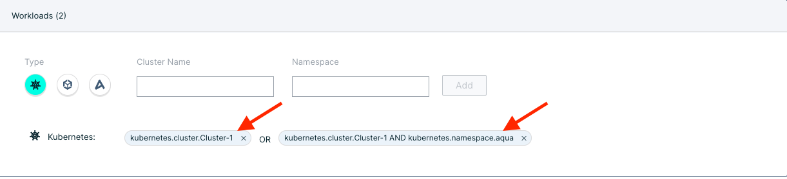
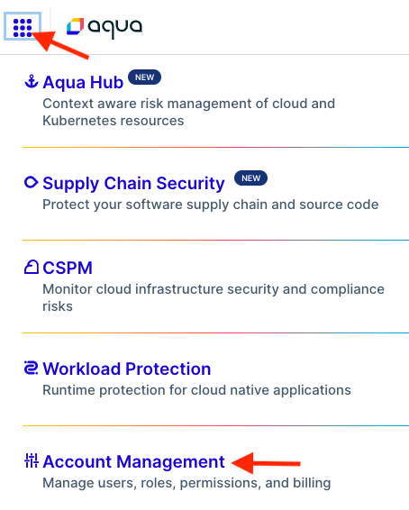
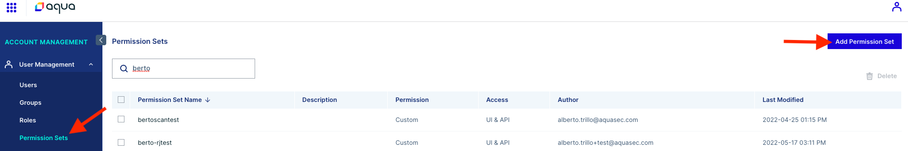
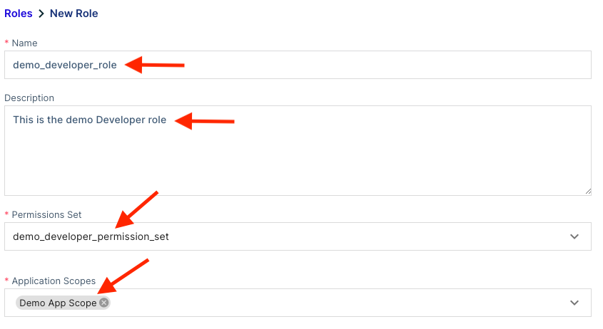
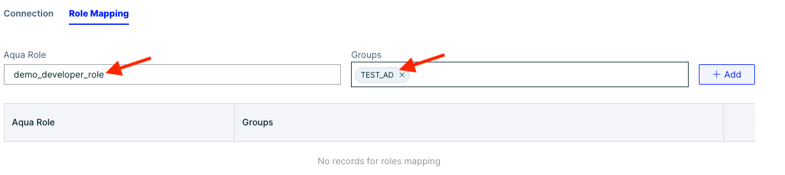

<!--  -->
<!--  -->

# RBAC Guide

## Overview

The purpose of this document is to provide guidance on how to leverage permission sets, roles, and application scopes to create an RBAC model that works for the organization.

!!! important "Important"
    Consult the organization's security team when mapping out the permission sets, roles and application scopes to align administrative and security teams towards a common goal

## User Login

!!! tip "Tip"
    SSO Integration would be ideal for proceeding with this document, but it is not required

Users who login to the Aqua Console will be assigned a **role** which is assigned a **permission set** and can be bound to a specific **application scope** or be set to the **Global** application scope. Below is an illustration of how a **user permission** can look like.

!!! note Note
    Multiple application scopes can be assigned to an **Aqua Role**. Be careful on the addition of ***multiple*** **Application Scopes**, it may provide a user more access to resources they do not need to see.

In the next few sections we will breakdown how it all pieces together to provide a user access to resources. We will start with **application scopes** to scope resources and view granularity, followed by **permission sets** to illustrate the possible permissions, and finally the **Aqua Role** describing the possible management of delegating access to resources leveraging an **Aqua Role**.

## Application Scopes

Application Scopes are used to granularize access to ***specific*** resources within the environment. Application Scopes are broken down into 3 parts

- Artifacts
- Workloads
- Infrastructure

These components breakdown the ecosystem into registries, running workloads, and clusters/VMs hosting the containers. For more information see the [References](#references) section for **application scopes**

### Artifacts

Artifacts grant the access to the container registries, repositories, and images that are ***configured within the Aqua Console***. This section will focus on the **image** attribute of **Artifacts**.

1. To access **Application Scopes** navigate to **Administration** > **Application Scopes**
    

1. Click on **Add Scope** on the **top right**

    

1. The configuration for the application scope will appear, enter the following:

   - **Name** - Name of the **Application Scope**

   - **Description** - Description of the scope, be it team or service, or groups of services

   - **Owner Email** - Creator of the **Application Scope**
     

1. Ensure the middle icon (***image***) is selected, there are two ways to scope access to repostories & images.

   - Add the registry, this method will allow ***everything*** in the **registry** to be visible when the scope is assigned.
     

   - Add the **registry** ***and*** include a **repository**, **many repository**, **a specific image within a repository** or **many images within the repository**
     

Once the access is granted for the ***Artifacts*** section, we can move to ***Workloads*** and ***Infrastructure***

### Workloads

Workloads pertain to the running workloads within the environment, these can be scoped to **kubernetes**, **enforcer group**, and more. For additional details see **Application Scopes** under the [Reference](#references) section. For the example we will be using **Kubernetes** as the **Workloads** attribute.

1. Follow the first ***two*** steps from the [Artifacts](#artifacts) section to navigate to the application scope, configure the workload section.

1. Similar to the **Artifacts** there are two ways to configure **Workloads**

   - Add the **cluster name** ***only*** which will grant access to ***all*** namespaces
     

   - Add the **cluster name** ***and*** one or more **namespace** names
     

!!! note "Note"
    Multiple **namespaces** can be added to workloads, ensure that caution is taken when adding various namespaces. More access can ***accidentily*** be granted than intended

Once the desired state is complete, we can move on to ***Infrastructure***

### Infrastructure

Infrastructure consists of a wide range of services, from **Kubernetes** to the **Enforcer Group** with different attributes such as **subcription** or **account ID**. or additional details see **Application Scopes** under the [Reference](#references) section. For the example we will be using **Kubernetes** as the type.

- Add the ***same*** **cluster** that was used for [Workloads](#workloads)
     

- Verify the ***cluster*** has been added
     

Many **clusters** can be added to this scope if needed. Once this portion is completed we can review what the full **Application Scope** looks like in the next section.

### Completed Application Scope

The Application Scope has been configured with

- Artifacts
- Workloads
- Infrastructure

This completes the creation of the **Application Scope**.

## Permission Sets

Permission sets provide the **access** to a given features or components within Aqua. They are broken down into 4 categories

- Policies
- Assets
- Compliance
- System

Various roles can be created and granular permissions applied to narrow down what users have access to, this can also be scoped to provide access to both **UI & API** or simply the **API Only**

This section will create a sample ***developer permission set*** to provide an example of granularity that can be achieved with permission sets.

!!! important "Important"
    The role that will be created is a sample role, it may or may not be usable in your environment. Refer to your organizational policies when creating permission sets

!!! note "Use Case"
    Create a developer role that will allow them to see **vulnerabilities** and **Aqua Services**

To create **permission sets**:

- **SaaS:** Navigate to the Aqua menu on the **top left** and select **Account Management**
  
  - Select **Permission Sets** and click on **Add Permission Set**
    
- **Self-Hosted:** Navigate to **Administration** > **Access Management** > click on the **Permission Sets** > **Add Permission Set**
  

The **name**, **description** and if the **permission set** can be used by both **UI & API** or simply **API Only**.

!!! note ""
    **Name:** demo_developer_permission_set
    **Description:** This permission set will allow developers to see vulnerabilities, workloads, and services
    **Access Type:** UI & API

Permissions will be added for the following **categories**

- Policy
- Assets
- Compliance

The following illustrates the **permissions** for each **category** and will be granted **view** permissions only.

| Policies | Assets | Compliance | Permission |
| :---------: | :------: | :---------: | :----------: |
| Firewall Policies | Dashboard | Vulnerabilities | View |
| | Risk Explorer | CIS Benchmarks | View |
| | Images | | View |
| | Enforcers | | View |
| | Containers | | View |
| | Services | | View |

!!!note Note "The permissions show a **count** of enabled permissions for **Edit**, **View Only**, and permissions **Not Set**"
**Policy**

**Assets**

**Compliance**

This completes the creation and permission assignments for the **Permission Set**. It can now be assigned to an **Aqua Role**

## Aqua Roles

Aqua Roles are used to grant permissions to **users** or **groups** within the Aqua UI or API. They leverage **permission sets** to allocate permissions to resources and Aqua features.

In this example an **Aqua Role** will be created and utilize the **permission set** created in the previous section [Permission Sets](#permission-sets)

### Creating the Aqua Role

- **SaaS:** Navigate to the Aqua menu on the **top left** and select **Account Management**
  

  - Under **User Management**, click on **Roles** and select **Add Role**
    

- **Self-Hosted:** Navigate to **Administration** > **Access Management** > click on the **Roles** > **Add Role**
  

Once the screen changes to create the **role**, we will define the following:

- Name
- Description
- Permission Set
- Application Scope(s)

!!! note "Note"
    Multiple **Application Scopes** can be added to a role, ensure that the **Application Scopes** created are well documented to ensure **just enough access** is granted for the organizational users

The **Aqua Role** is created and now can be assigned to users!

## SSO Role Mapping

!!! important "Important"
    SSO Integration must be completed and functional with assertions for users/groups being passed through prior to utilizing SSO Group Mapping

The prerequisites for RBAC have been created with the **Permission Sets**, **Aqua Roles**, and **Application Scopes**. **Users** or **groups** can now be onboarded and scoped to the **roles** that will **grant** them access to their resources.

Navigate to:

- **SaaS:** Navigate to the Aqua menu on the **top left** and select **Account Management**
  

  - Under **User Management**, click on **SSO Group Mapping**
  
    
  
  - To map a role select the **Aqua Role** to map to a **Groups**, and click **Add**
    

  - The role will be in the table below showing it was successfully added
    

- **Self-Hosted:** Navigate to **Administration** > **Integrations** > click on the **SSO Authentication** > **Role Mapping**
  

  - To map a role, start **typing** the name of the **Aqua Role** > type the **Groups** and click **Add**. Once completed click **Save** at the bottom of the page.
    
    

This concludes how to create **Application Scopes, Aqua Roles, Permission Sets,** and configure them to work together to provide granularity across groups or individual users.

!!! important "Important"
    If there are any issues, please contact Aqua Support

## References

- [Application Scopes](https://docs.aquasec.com/docs/application-scopes)
- [RBAC](https://docs.aquasec.com/docs/rbac-overview)
- Permission Sets
  - [RBAC Overview](https://docs.aquasec.com/docs/rbac-overview#section-permission-sets)
  - [Permission Sets Overview](https://support.aquasec.com/support/solutions/articles/16000121278-overview-of-permission-sets)
- [SSO Group Mapping](https://support.aquasec.com/support/solutions/articles/16000121292-sso-group-mapping)
