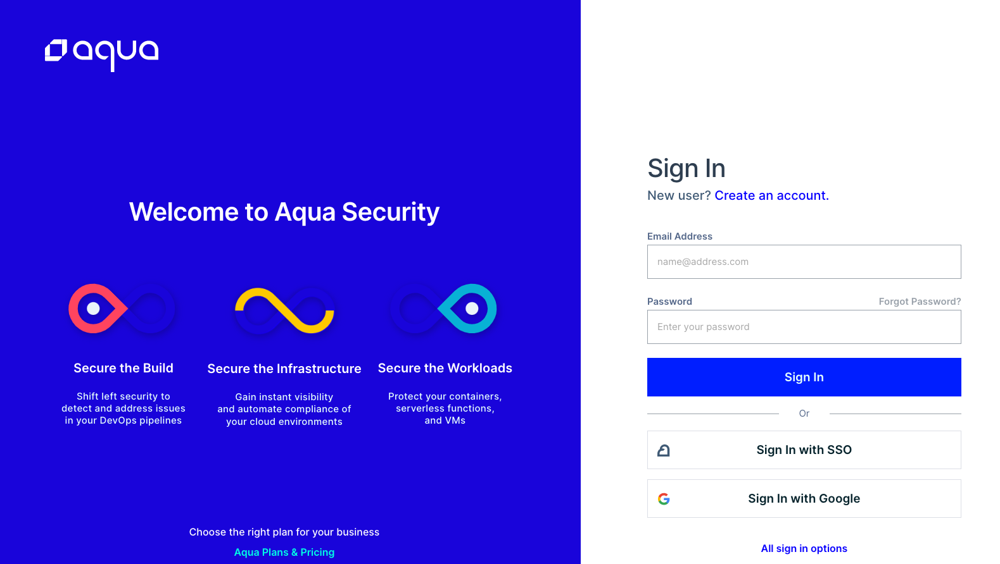
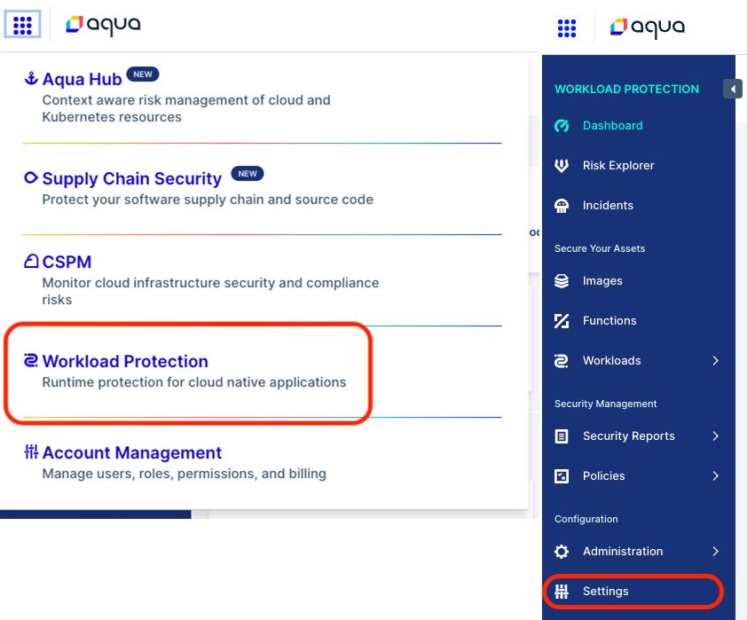
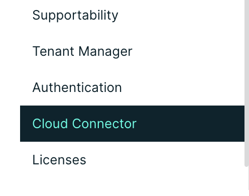
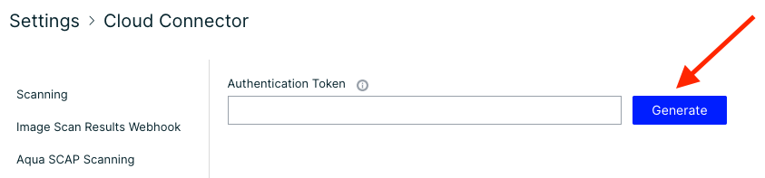
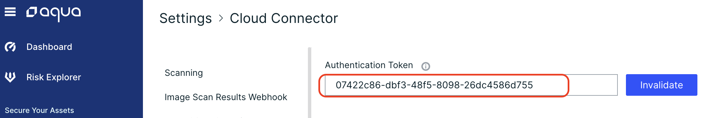
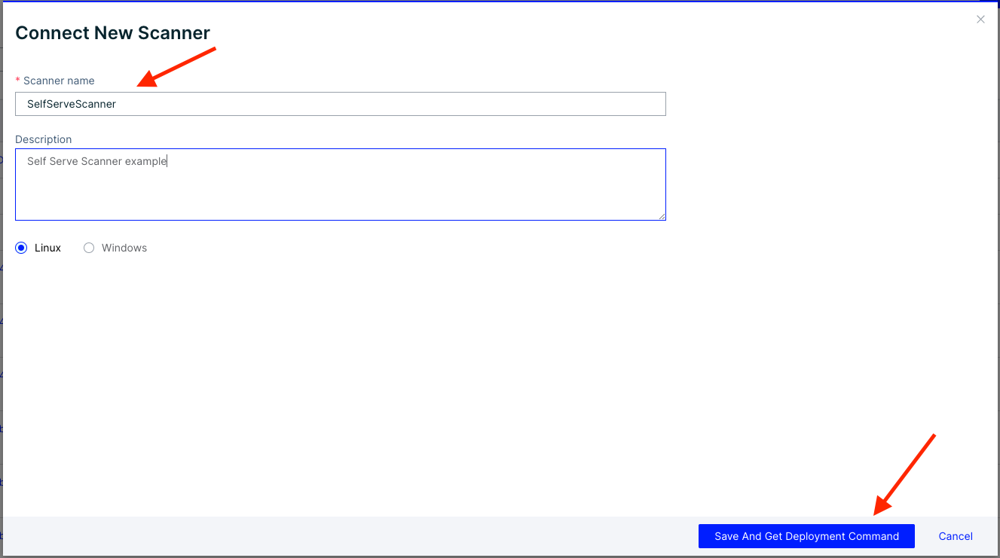
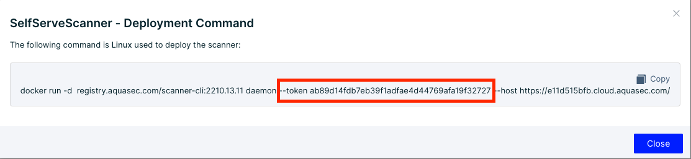
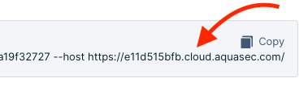
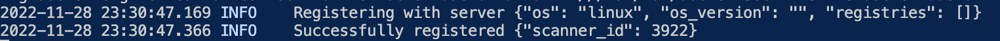

# Scanner and Cloud Connector Deployment

## Cloud Connector Deployment

The first step in deploying the Cloud Connector is to generate your authentication token:

1. Log into https://cloud.aquasec.com 

2. Navigate to Workload Protection and go to Settings

3. Under Settings, navigate to Cloud Connector

4. Click "Generate" next to the Authentication Token box 

5. Copy the token and paste into a notepad


## Deploy Cloud Connector with Helm

Aqua Helm Charts are located in our Github repository [here](https://github.com/aquasecurty/aqua-helm) or you can add the helm repository as below:
```
    helm repo add aqua-helm https://helm.aquasec.com
    helm repo update
```
If you didn't clone the helm repo from Github, you can pull the values yaml like using the following command:
```
    helm show values aqua-helm/cloud-connector > values.yaml
```
Modify the values.yaml for the cloud connector with your relevant information:

Add the image pull secret here if needed:
```
    imageCredentials:
      create: true
      name: <registry name> ## When create is false please specify
      repositoryUriPrefix: <repository URI> # for dockerhub - "docker.io"
      registry: <registry URL> #REQUIRED only if create is true, for dockerhub - "index.docker.io/v1/"
      username: ""
      password: ""
```
Specify whether or not the Service Account needs to be created:
```
    serviceaccount:
      create: false
      name: aqua-sa
```
Add your SaaS Gateway address and port 443:
```
    gateway:
      host: "<ID>-gw.cloud.aquasec.com"   # Gateway Host Address
      port: "443"               # Gateway Port
```
Ensure that auth type is set to Token:
```
    authType:
      tokenAuth: true     # Boolean Value(true/false) to enable/disable token based authentication
      userCreds: false    # Boolean Value(true/false) to enable/disable user/password authentication
```
Specify the resource limits according to your environment needs or use the defaults:
```
    resources:
      # Note: For recommendations please check the official sizing guide.
       requests:
         cpu: 500m
         memory: 0.5Gi
       limits:
         cpu: 2000m
         memory: 2Gi
```
Lastly, configure your tunnels to your local private registries:
```
    tunnels:
      # ACR - Azure Container Registry
      azure:
        registryHost: ""
        registryPort: ""
      # ECR - Amazon Elastic Container Registry
      aws:
        registryHost: ""
        registryPort: ""
        type: ""
        region: ""
      # GCR - Google Container Registry
      gcp:
        registryHost: ""
        registryPort: ""
      # JFrog Container Registry
      jfrog:
        registryHost: ""
        registryPort: ""
      # Onprem Container Registry
      onprem:
        registryHost: ""
        registryPort: ""
```
Deploy the cloud connector by running the following commands:
If you cloned the aqua-helm rpository:
    
```
    #Run commands from the root of the aqua-helm directory
    kubectl create ns aqua
    helm install --namespace aqua <releaseName> ./cloud-connector
```
If you are installing from the Helm repository:
```
    helm install --namespace aqua <releaseName> aqua-helm/cloud-connector -f <location of the values.yaml>
```
You can verify that the cloud connector is connected to the console by checking the cloud connector logs. You should see the following message when you are connected to the console:
<br>
*** "connection established with remote server" ***

## Deploy Scanners

After deploying the cloud connector you can now deploy the scanners
Be sure to review the following sizing guide recomendations for your scanner deployment:

| **Component** | **Resource** | **Sizing** |
|               |              |            |
| Aqua Scanner Legacy (ea) | CPU | 1,000 - 2,000 |
|  | Memory | 0.5 - 1.0 |
|  | Storage | At least twice the size of largest image |
| Aqua Trivy Premium | CPU | 1,500 - 4,000 |
|  | Memory | 0.5 - 3.0 |
|  | Storage | At least twice the size of largest image |

Like the Cloud Connector, the first step to deploying the Scanner is to create your Scanner and Authentication Token

1. Navigate to Workload Protection and go to Administration -> Scanners
2. Click Connect Scanner

<table><tr>
<td>  </td>
<td>  </td>
</tr></table>

3. Give your scanner a name and description then click --> Save And Get Deployment Command

4. Copy the authentication token and paste it into a clipboard for later

5. Copy the Host URL and paste it into the clipboard for later


## Deploy the Aqua Scanner with Helm

Aqua Helm Charts are located in our Github repository [here](https://github.com/aquasecurty/aqua-helm) or you can add the helm repository as below:

```
    helm repo add aqua-helm https://helm.aquasec.com
    helm repo update
```
If you didn't clone the helm repo from Github, you can pull the values yaml like using the following command:
```
    helm show values aqua-helm/scanner > values.yaml
```
Modify the values.yaml for the scanner with your relevant information:

Add the image pull secret here if needed:
```
    imageCredentials:
      create: true
      name: <registry name> ## When create is false please specify
      repositoryUriPrefix: <repository URI> # for dockerhub - "docker.io"
      registry: <registry URL> #REQUIRED only if create is true, for dockerhub - "index.docker.io/v1/"
      username: ""
      password: ""
```

Enable or disable Direct CC - This setting determines if the scanners connect directly to Cybercenter or if only the console does.  Recomended to leave as "True"

```
    directCC:
      enabled: true     # Change it to false if the scanners don't connect directly to CyberCenter but only console does
```

Specify whether or not the Service Account needs to be created:
```
    serviceaccount:
      create: false
      name: aqua-sa
```

Set your console scheme to "https", add your unigue console URL, and change the port to 443:
```
    server:
      scheme: "https" #specify the schema for the server host URL, default it is http
      serviceName: "<ID>.cloud.aquasec.com" # example
      port: 443
```
Add the token that you copied earlier here:
```
    scannerToken: ""    # token used for deploying USE scanners
```
Set any extra environement variables needed by the scanner pods here (ex. http_proxy, https_proxy, etc...):
```
    extraEnvironmentVars: {}
    #  ENV_NAME: value
```
Optional: Here you can specify the registries that these scanners will connect to:
```
    registries: []
    # registries:
    # - registry1
    # - registry2
```
Deploy the cloud connector by running the following commands:
If you cloned the aqua-helm rpository:
<br>
*** Dont forget to set your release name to begin with a numeric value to move it to the top of the list ***
```
    #Run commands from the root of the aqua-helm directory
    kubectl create ns aqua
    helm install --namespace aqua <releaseName> ./scanner
```
If you are installing from the Helm repository:
```
    helm install --namespace aqua <releaseName> aqua-helm/scanner -f <location of the values.yaml>
```
You can verify that the scanners are connected to the console by checking the UI of the console or checking the pod logs:



# [Connect the Private Registry](../shiftleft/registrysetup.md) 