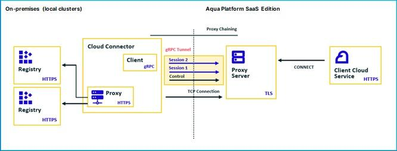

## Aqua Scanner

The primary function of the Aqua scanner (or simply "scanner") is to scan the following types of objects for security issues:

* Container images
* VMware Tanzu applications
* Functions (serverless)

Security issues are defined as vulnerabilities, sensitive data, and malware. The scanner looks for the following, depending on the scanned object type:

| **Scanned object**   | **Security Issues Scanned For**                             |
|                      |                                                             |
| **Container Images** | Vulnerabilities, sensitive data, and malware                |
|                      |                                                             |
| **VMWare Tanzu**     | Vulnerabilities, sensitive data, and malware                |
|                      |                                                             |
| **Functions**        | Vulnerabilities, sensitive data, and excessive permissions. |

Object scanning is supported by the [Aqua CyberCenter](https://docs.aquasec.com/v2022.4/platform/aqua-cybercenter/cybercenter-description/), which maintains up-to-date information on vulnerabilities and malware. Once an object is scanned, the scanner reports the results to the Aqua Server, which makes them available through the Server UI and REST APIs.

Secondary functions of the scanner include registering container images with Aqua and importing results of scans already performed.

## Aqua Cloud Connector

The Aqua Cloud Connector is used in conjunction with Aqua Platform SaaS Edition (Enterprise Plan) and ESE environments.

When deployed on local clusters, i.e., clusters on which Aqua Platform is not deployed, the Aqua Cloud Connector establishes a secure connection to the Aqua Platform console, giving Aqua Platform remote access to resources on the local clusters.

The local resources supported are registries for container images and serverless functions; for simplicity, we will refer to all as images. Once you deploy the Connector on a local cluster, you are ready to go! You can create a new image registry integration and test its connectivity to ensure the deployment is successful. Once the integration is saved, the Aqua Platform console can access your registry and perform standard Aqua Enterprise operations, such as searching the registry for images and auto-pulling them. Image scanning is performed by Aqua Scanners deployed on your local clusters.

### Architectural diagram

### Cloud Connector Deployment and Configuration

The Aqua Cloud Connector is deployed as a simple Kubernetes deployment, and its configuration can be controlled by a ConfigMap.

## Deploy Scanners and Cloud Connector for Private Registries
1. Create Scanner token in CWPP -> Administration -> Scanners -> Connect Scanner
2. Per sizing requirements in step 1, deploy local scanners into tooling environment with access to private registries
3. Configure cloud connector per the documentation.
4. Deploy cloud connector into tooling environment with access to private registries

Be sure to review the following sizing guide recomendations for your scanner deployment:

| **Component** | **Resource** | **Sizing** |
|               |              |            |
| Aqua Scanner Legacy (ea) | CPU | 1,000 - 2,000 |
|  | Memory | 0.5 - 1.0 |
|  | Storage | At least twice the size of largest image |
| Aqua Trivy Premium | CPU | 1,500 - 4,000 |
|  | Memory | 0.5 - 3.0 |
|  | Storage | At least twice the size of largest image |