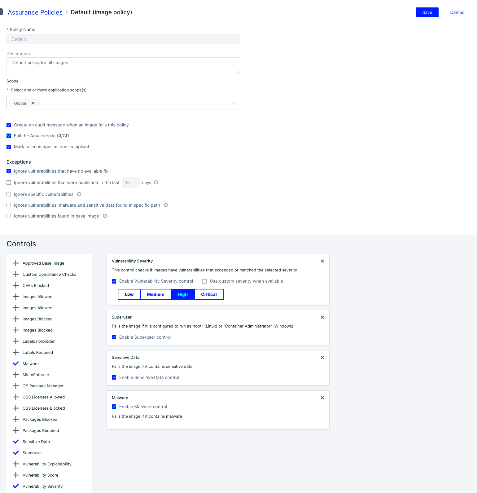

# Image Assurance Policies

## Image Assurance Overview

Aqua Enterprise provides full lifecycle security for:

* Containerized applications, running either on Linux or Windows hosts
* VMware Tanzu applications, running on Linux hosts; see also below

The overall goal of full container lifecycle security is the deployment of applications that ensure the security of your applications' operations, data, and computing infrastructure.

Aqua Image Assurance covers the first part of the container lifecycle: image development. The Image Assurance subsystem detects, assesses, and reports security issues in your images. Next, Aqua provides different forms of risk management, based on your preferences:

* Aqua can block the deployment of containers based on images with security issues.
* Alternatively, it can help you mitigate the risk of deploying such containers based on images with known risks.
* Through Risk-based Insights, Aqua can also identify running containers based on images with vulnerabilities and known exploits "in the wild".

This section describes the Image Assurance activities performed by Aqua throughout the image development lifecycle.

### **Tanzu applications**

**Terminology differences**

* VMware Tanzu Application Service (TAS) is the new commercial name for the Pivotal Application Service (PAS). Some Aqua Enterprise artifacts related to Tanzu Application Assurance (UI, etc.) still reflect the older name or Cloud Foundry (CF).
* The Tanzu equivalent of an image registry is a VMware Tanzu Application Service blobstore.
* A Tanzu application is called a droplet.
* In Aqua Enterprise, you can define and configure VMware Tanzu Application Assurance Policies in the same manner has you define and configure Image Assurance Policies for containerized applications.

**Support limitations**

Aqua Enterprise support for VMware Tanzu applications has certain limitations with respect to support for containerized applications. See Platform Support Differences and Limitations, Tanzu Application Service (TAS). These limitations apply to Image Assurance as well as runtime (deployed containers).

### **Image Assurance activities**

Image Assurance comprises the following main activities. Click on the links for further information.

* ***Static scanning*** of your images for static security issues (vulnerabilities, sensitive data, and malware) and assessing their importance
* Dynamic scanning of your images, using ***Aqua Dynamic Threat Analysis (DTA)***. DTA runs container images in a safe and isolated sandbox environment, and monitors behavioral patterns and Indicators of Compromise (IoCs) such as malicious behavior and network activity. **(DTA is not available for VMware Tanzu applications.)**
* ***Evaluation of image compliance*** with the ***Image Assurance Policies*** **(or Tanzu Application Assurance Policies)** that you define and configure
* ***Reporting the results*** of the scanning and compliance evaluation in the Aqua UI, as well as to third-party ***SIEM (security information and event management)*** systems integrated with Aqua
* ***Risk management*** as appropriate for your organization's security requirements

## Image Assurance Basics

### **Image Assurance Policy components**

An Image Assurance Policy consists of:

**Application scopes and Additional scope criteria:** define set(s) of images to which the policy will be applied; see Policy Scope

**Actions:** what Aqua will do if an image fails the Image Assurance Policy

**Exceptions:** items that evaluation of the Image Assurance Policy should ignore

**Controls:** individual tests that are evaluated on the results of image scans

### **Actions**
You can select any or all of the following actions to be taken for an image if a given Image Assurance Policy fails:

**Create an audit message when image failed:** An entry is added to the Audit log, indicating the reason the policy failed

**Fail the Aqua step in CI/CD:** An image build that is scanned during the CI/CD process will be marked as failed, and cannot be pushed to a repository

**Mark failed images (VMware Tanzu applications) as non-compliant:** At runtime, if the Container Runtime Policy for the container with this image includes the control Block Non-compliant Images, the Enforcer will prevent the container from running the rejected image.

### **Exceptions**
You can select any or all the following exceptions to the evaluation of the Image Assurance Policy:

**Ignore vulnerabilities that have no available fix:** If selected, vulnerabilities for which there is no known solution will not trigger policy failure.

**Ignore vulnerabilities that were published in the last [nn] days:** Provides a "grace period" of 1-999 days for vulnerabilities that are less likely (due to their newness) to have exploits.

**Ignore specific vulnerabilities:** If selected, you can list any number of specific vulnerabilities (e.g., CVE-2019-1234) on separate lines.

**Ignore vulnerabilities and malware found in specific path:** If selected, you can list any number of paths (resources) on separate lines. Vulnerabilities and malware found in those paths will not cause policy failure. The paths must be entered in gitignore syntax (e.g., /projects/proj1.

**Ignore vulnerabilities found in base image:** If selected, current policy ignores vulnerabilities found in its base image layers and fails if vulnerability controls are triggered for vulnerabilities found in an image’s non-base layers.

## Configure the Default Image Assurance Policy

Aqua comes with Default Policies that are always present and cannot be deleted.  The ***Default Image Assurance Policy*** comes with no controls enabled and applies to the ***Global Application Scope***.  The controls are intentionally left empty as every organization will customize these to their needs. Below will be the base recomendations for the Default Image Assurance Policy.

Navigate to the "Policies" and click "Assurance Policies" 

Select the "Default" Image policy 

You will notice that there are no controls in place. The follwoing are the recomended controls for the default policy. Keep in mind that organizations will need to customize these to fit their needs.  ex. enabling the "Superuser" control may block infrastructure build images.

For now, enable the following controls:

* Create an audit message when an image fails this policy
* Fail the Aqua step in CI/CD
* Mark failed images as non-compliant
* Ignore vulnerabilities that have no available fix
* Malware
* Sensitive Data
* Superuser
* Vulnerability Severity - Check Enable Vulnerability Severity Control and set to High

Click "Save"

It will look like this when done:

