# Registry Setup
Once the Cloud Connector and Scanners are deployed, private registries can now be connected

## Integrate a Private Registry

1. Navigate to Workload Protection and go to "Administration" on the left navigation bar
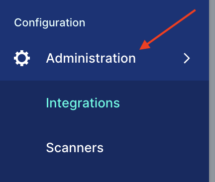
 

2. Click "Integrations"

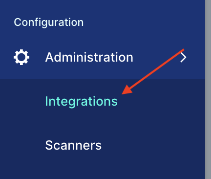

3. Click "Image Registries"
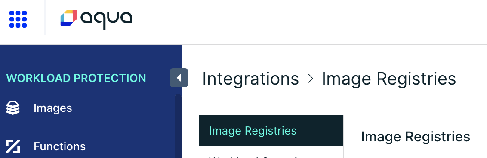

4. Click "Add Registry"
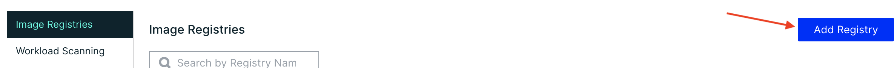

5. Create a name for the registry to be added
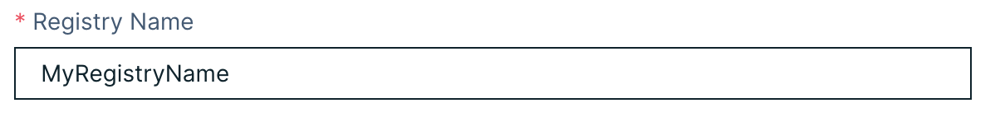

6. Select the "Registry Type" here we are adding a "Sonatype Nexus Repository OSS" registry
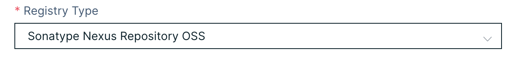

7. In the "Connect through section, click the radio button next to "Specific Scanner"
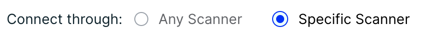

8. Select your scanner in the drop down list
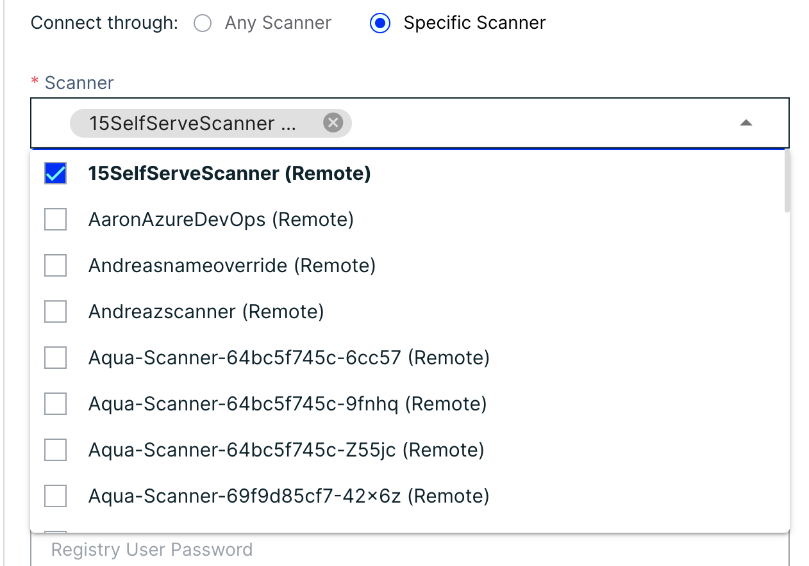

9. Add the registry URL
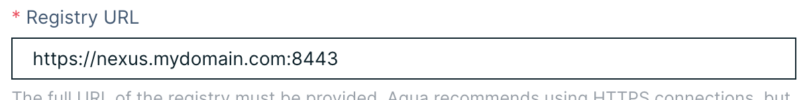

10. Add the proper credentials in the Username and Password fields
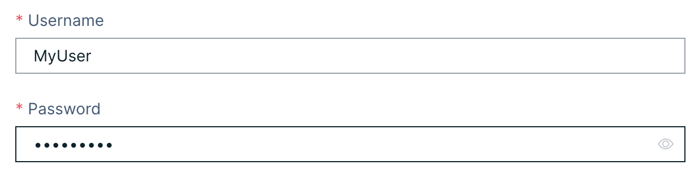

11. Test your connection by clicking the "Test Connection" button
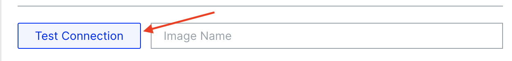
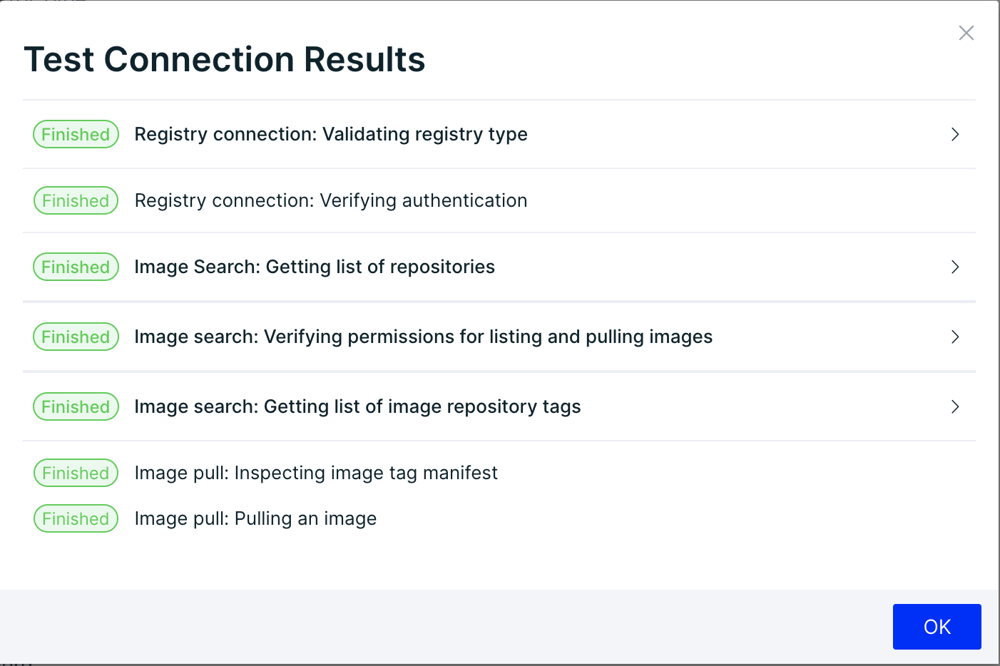

12. Once the registry has successfully connected, click "Save" in the top left of the page
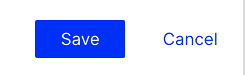

## Configure Registry

Once the registry is connected, it will need to be configured for automated scanning. 

1. Click "Registry Configuration"
 
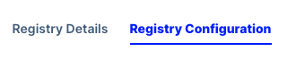

2. Set "Scan Timeout" if necessary - Scan timeout determines how long the scan will take to timeout and re-queue
3. Add any image prefix necessary for the registry
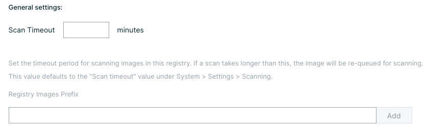

4. Click "Automatic"
5. Set the schedule day and time - remember that the server is on UTC so make adjustments accordingly
6. Check "Rescan Existing Images" (recomended)
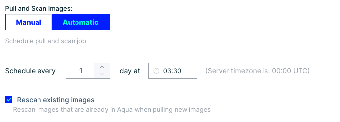

7. Under "Advanced Settings" additional criteria for scans can be set such as; name/tag, image creation time, and latest verions
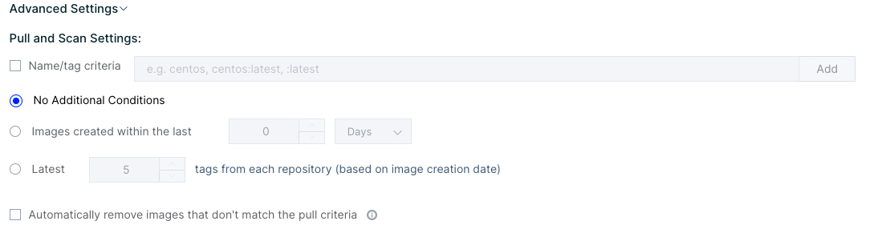

8. Under "Exceptions" criteria for always pulling images or never pulling images accorging to name/tag pattern can be set
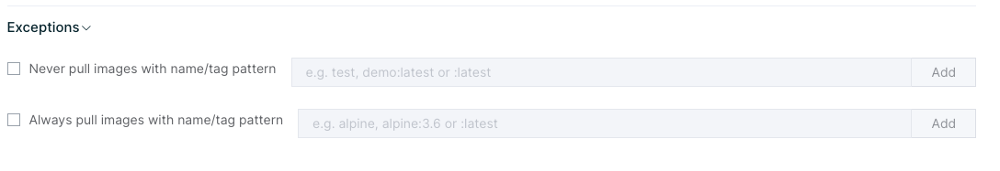

9. It is recomended to turn on the Auto clean up under the "Cleanup Settings" This will remove images and repositories that are no longer present in the Aqua Console
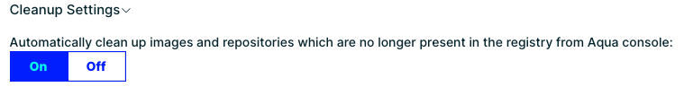

10. Don't forget to click "Save" when done

Once the registry has been connected and configured, Image Assurance Policies should be configured next. Click the link below to move to the next step:

## [Image Assurance Policy Setup](../shiftleft/imageassurancepolicies.md)