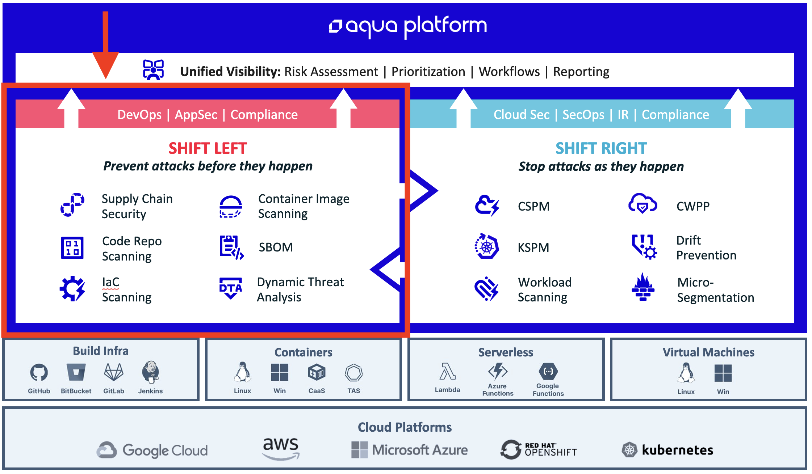

## Introduction to Shift Left

Welcome the Guided Path for Aqua Shift Left customers! This is your complete guide to all of the steps that you will need to complete in order to successfully onboard with the Aqua Platform.  

The Shift Left package is for customers who are looking to secure their development environments, code repositories and container images that are used to create used to build containers that can be deployed into a live workload in Production. While the entire Aqua Platform can secure running workloads using the Runtime Protection capabilities of Aqua, these features are included within the Shift Right subscription. 

This Guided Path is designed to describe each of the steps necessary to complete the deployment of the following Aqua components. 

1. Supply Chain Security
2. Code repository scanning
3. Infrastructure as Code (IaC) scanning
4. Container Image scanning
5. Software Bill of Materials (SBOM)
6. Dynamic Threat Analysis

The diagram below shows the entire Aqua Platform and highlights the **Shift Left** components and how the platform protects your development assets, cloud infrastructure and production workloads.  

 