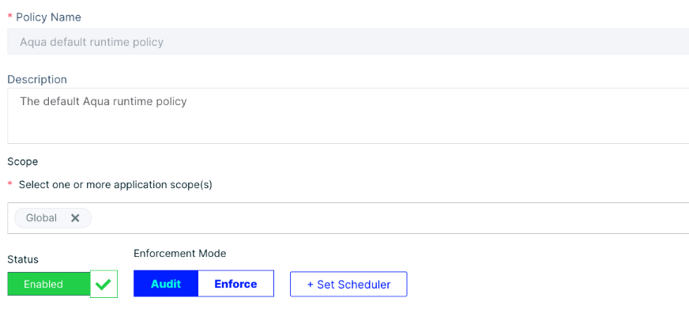
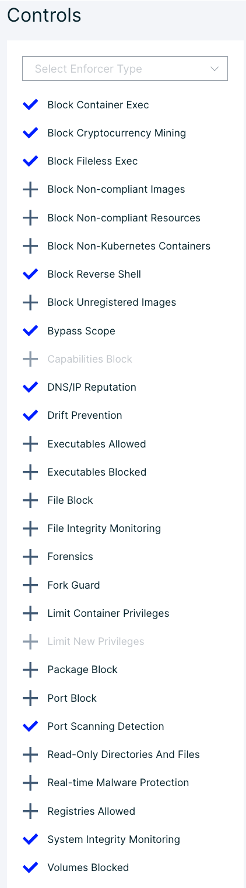
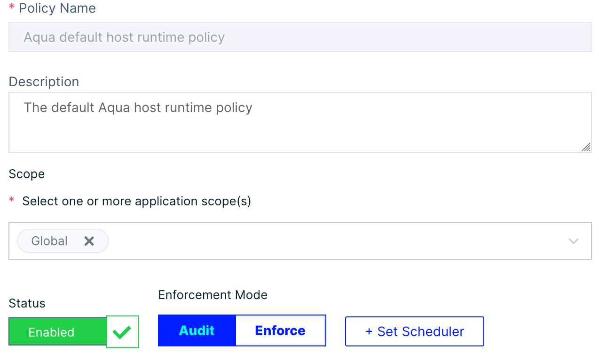
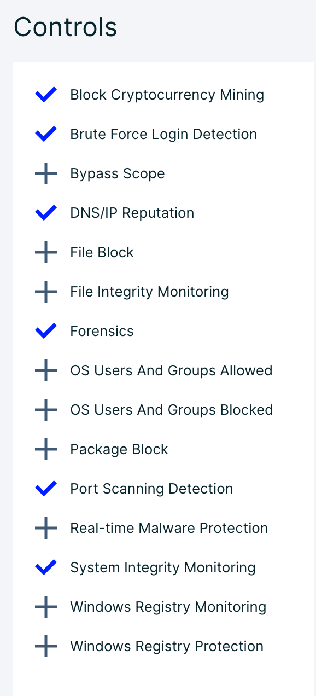

# Container Runtime Policies

## Container Runtime Overview

Aqua Enterprise provides admission control & security audit/prevention for:

* Containerized applications, running either on Linux or Windows hosts
* Containerized applications, running either on serverless infrastructure
* Kubernetes based resources
  * Workloads
  * Services
  * Roles and RoleBindings
  * ConfigMaps

Aqua Runtime Policies cover the last part of the container lifecycle: container deployment. The Runtime system detects, reports, and blocks security issues at your container. Next, Aqua provides different forms of protection, based on your preferences and maturity:

* Audit only for container activity.
* Aqua can block the deployment of containers based on images with security issues or no security status.
* Additionally, Aqua can enforce runtime parameters or exclude any drift or change to the container, from execution.

<!---
### **Runtime activities**

Enforcer Runtime comprises the following main activities. Click on the links for further information.

* **Workload image scanning** identifies unregistered containers running in the environment and returns an analysis of the image and its status as registered.
* Advanced Malware Protection
* ***Workload monitoring*** monitors container activity, storing it, and pushing to a third-party SIEM integration
* ***Workload enforcement*** blocks runtime container activity that otherwise would be only audited

--->

## Runtime Basics

### Runtime Policy components

A container Runtime Policy consists of:

**Application scopes and Additional scope criteria:** define set(s) of images to which the policy will be applied; see Policy Scope

**Status:** indicates the status of the policy, if enabled or disabled at a system level

**Enforcement Mode:** sets the mode of the policy, audit or enforce, and only takes enforcement effect when 'Enabled' and the Enforcer is in enforce as well.

**+ Set Scheduler:** configures a schedule to change the policy from audit to enforce in the number of days.

### **Select Enforcer Type**

This list includes Aqua Enforcer, KubeEnforcer, and the MicroEnforcer and will filter controls to only those supported by the enforcer type.  These limitations tend to exist due to the type of infrastructure used and the required component to support it.

## Configure Default Runtime Policies

!!! note "NOTE"

    The policies themselves are in audit mode and cannot be enforced unless updated. In addition, the enforcer or enforcer group requires runtime & network protection to be enabled for the controls to be audited or enforced.

!!! warning "Warning"

    Forensics & File Integrity Monitoring is a useful tool for runtime policies with the ability to audit files,processes and network activity. This can be quite verbose and may consume the entirety of the database storage or allocated resources if not prepared. Please see [advanced policy configuration](../shiftright/advanced-cwpp.md) for more.

### Container

Aqua comes with Default Policies that are always present and cannot be deleted.  The ***Aqua default runtime policy (container)*** comes with several controls enabled and applies to the ***Global Application Scope***.  These controls are designed as universal safeguards against general malicious/unwanted behavior or is directly against container best-practice.

* Block Cryptocurrency Mining
* Block Fileless Exec
* Bypass Scope
* DNS/IP Reputation
* Drift Prevention
* Volumes Blocked

Workloads tend to differ, and although the above are most applicable, other controls may be used in addition with similar low risk. Runtime is more likely to have several policies with different application scoping so every organization can customize these to their needs or be excluded from controls not applicable. Below are be the base recommendations for the Default Runtime Policy.

Navigate to the "Policies" and click "Runtime Policies"

Select the "Aqua default runtime policy"

You will notice the above controls in place, but the following are the full recommended controls for the default policy. Keep in mind that organizations will need to customize these to fit their needs.  ex. enabling the "Superuser" control may block infrastructure build images.

You can leave this policy as-is or add additional controls to yield the following policy:

* Block Container Exec
* Block Cryptocurrency Mining
* Block Fileless Exec
* Block Non-Kubernetes Containers (if running on kubernetes)
* Block Reverse Shell
* Bypass Scope
* DNS/IP Reputation
* Drift Prevention
* Port Scanning Detection
* System Integrity Monitoring
* Volumes Blocked

Click "Save"

It will look like this when done:

f

### Host

Aqua comes with Default Policies that are always present and cannot be deleted.  The ***Aqua default runtime policy (container)*** comes with several controls enabled and applies to the ***Global Application Scope***.  These controls are designed as universal safegaurds against general malicious/unwanted behavior or is directly against container best-practice.

* Brute Force Login Detection
* System Integrity Monitoring
  * System Time - Monitor changes to system time
  * Monitor system log integrity
* Forensics*
  * Audit host successful login events
  * Audit host failed login events

You can leave this policy as-is or add additional controls to yield the following policy:

* Block Cryptocurrency Mining
* Brute Force Login Detection
* DNS/IP Reputation
* Forensics
  * Audit host successful login events
  * Audit host failed login events
* Port Scanning Detection
* System Integrity Monitoring
  * System Time - Monitor changes to system time
  * Monitor system log integrity

Click "Save"

It will look like this when done:

