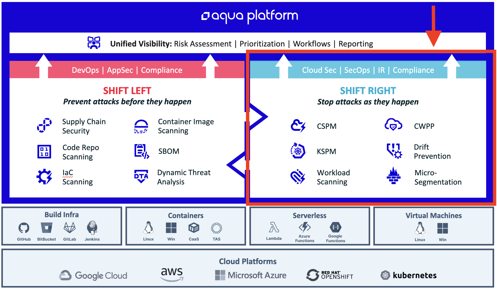

# Shift Right

Welcome the Guided Path for Aqua Shift Right customers! This is your complete guide to all of the steps that you will need to complete in order to successfully onboard with the Aqua Platform.  

The Shift Right package is for customers who are looking to secure their cloud subscriptions, Kubernetes clusters, and containerized workloads. While the entire Aqua Platform can secure running workloads using the Runtime Protection capabilities of Aqua, these features are included within the Shift Left subscription. 

This Guided Path is designed to describe each of the steps necessary to complete the deployment of the following Aqua components. 

1. CSPM
2. KSPM
3. Workload Scanning
4. CWPP
5. Drift Prevention
6. Micro-Segmentation

The diagram below shows the entire Aqua Platform and highlights the **Shift Right** components and how the platform protects your development assets, cloud infrastructure and production workloads.  
# 
