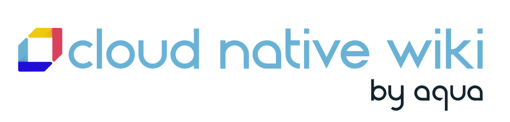
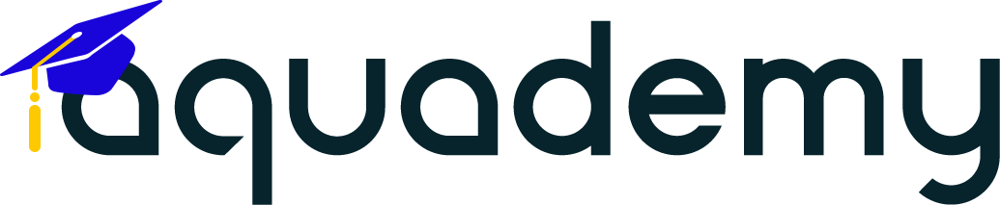

# Useful resources for your Aqua jpurney

The following resources are available to every Aqua customer with a valid subscription to the Aqua Platform:

## Aqua Cloud Native Wiki

Aqua has provided an introduction to many key concepts that will be needed to complete the deployment of the Aqua Platform. Many of the core cloud security and modern application development practices are described in this Wiki site and it is a great place to learn the basics of Cloud Native security. Start reading at [the Cloud Native Wiki site](https://www.aquasec.com/cloud-native-academy/cspm/cloud-security/).

## Aqua Support

Product support is available via our Support Portal located at [support.aquasec.com](https://support.aquasec.com). From here you may open a support ticket, browse knowledge base articles and locate information on new releases of the Aqua Platform. 

## Product Documentation

Official product documentation for each release of the Aqua Platform is available for all customers at [docs.aquasec.com](https://docs.aquasec.com). Here you will find all of the reference guides and  API documentation for the Aqua platform. 

## Aquademy

The Aquademy is your one stop solution to finding Educational materials that will help you on your journey with Aqua. We provide all levels of Education on our learning platform and you can progress from the very first steps to taking practical, hands on labs in our self paced training. If you would like to take more advanced trainign our would like to have an instructor teach your team we can arrange that too in the Aquademy. Please see [aquademy.aquasec.com](https://aquademy.aquasec.com) for more information. 